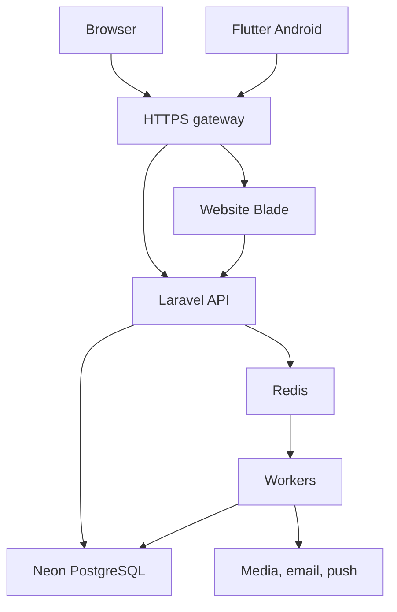

# Arsitektur — monorepo RT05 TAKEDA

## 1. Keputusan utama

Modular monolith Laravel untuk bisnis, website Laravel terpisah untuk rendering Blade, dan satu Flutter application. Semua modul berada dalam satu repo; dapat dibangun/deploy terpisah. Tidak membutuhkan npm workspace global untuk memaksa PHP/Dart menjadi satu runtime.

Website mempunyai shell Laravel karena Blade membutuhkan renderer. Shell itu bukan pemilik database warga. Tidak menduplikasi User, Payment, atau migration domain bisnis ke website/. API mempunyai seluruh persistence domain.

## 2. Aliran runtime

Website menggunakan API internal read-only untuk SSR konten published. Browser CMS dan Flutter memanggil API melalui gateway. Worker menggunakan image API yang sama. Scheduler memicu command/outbox/jobs. Postgres menjadi sumber kebenaran; Redis tidak menyimpan satu-satunya salinan transaksi bisnis.

## 3. Gateway dan URL

Host production rancangan: https://takeda.morriz.tech.

| Path | Upstream |
| --- | --- |
| /api/v1/* | api-nginx → api PHP-FPM |
| /sanctum/csrf-cookie | api-nginx → api PHP-FPM |
| /health/live dan /health/ready | API; response minimal |
| /media/public/* | media publik dari storage terkontrol |
| Path lain | web-nginx → website PHP-FPM |

Proxy mempertahankan path, host, forwarded proto, dan client IP sesuai trusted proxy configuration. /api tidak boleh jatuh ke fallback HTML website.

Satu origin dipilih untuk menyederhanakan cookie CMS, CSRF, dan CORS. Mobile memakai host/path yang sama. Tidak perlu subdomain API tambahan pada v1. Host staging terpisah: takeda-staging.morriz.tech, dengan env/data/secrets sendiri.

## 4. Autentikasi

- Mobile: email/password → Sanctum bearer token per perangkat, expiry 30 hari rancangan; secure OS storage; logout mencabut token.
- Web CMS: session cookie Sanctum yang dibuat API, HttpOnly/Secure/SameSite=Lax; CSRF untuk mutation; browser fetch credentials.
- Halaman CMS boleh berupa shell publik; data, preview server, upload, dan publish wajib admin auth di API. Shell tidak boleh menyertakan data privat.
- Token registrasi enam digit hanya gate pendaftaran; terpisah dari session/API token.
- Role dan status akun diperiksa API pada setiap request, termasuk setelah role/revocation berubah.
- Website shell memakai cookie name berbeda dari API dan tidak menganggap cookie terenkripsi API sebagai sesi miliknya.

Mobile tidak memakai cookie browser/CSRF flow. CMS tidak menyimpan bearer token admin pada localStorage.

## 5. Modul API

| Domain | Isi |
| --- | --- |
| Identity | Register, login, reset, invites, status/role |
| Residents | Rumah, keluarga, anggota, occupancy, link akun |
| Complaints | Pengaduan, status, foto, privacy serialization |
| Aspirations | Aspirasi dan histori |
| Community | Agenda, pengumuman, notifikasi |
| Content | Artikel, album, fasilitas, draft/publish |
| Finance | Tarif, tagihan, pembayaran, kas, reversal |
| Operations | Audit, outbox, exports, health |

Struktur sederhana: Controllers, FormRequests, Policies, Resources, Models, Actions per domain, Jobs, Console Commands. Tambahkan service hanya untuk transaksi/integrasi yang nyata. Hindari generic repository untuk setiap tabel tanpa kebutuhan.

## 6. Konsistensi

Mutation penting: DB transaction + audit + outbox. Setelah commit, outbox diproses untuk notifikasi/media/cache. Side effect boleh retry; uang dan status tagihan tidak diproses hanya lewat queue.

Gunakan database row locks serta constraint unik untuk transaksi bersamaan. Redis lock hanya mengurangi pekerjaan ganda; constraint Postgres tetap melindungi integritas setelah restart.

Public content cache dipurge setelah publish/arsip; TTL pendek menjadi pemulihan bila invalidation tertunda. Web menampilkan konten published terakhir yang valid ketika API sementara gagal; tidak menampilkan draft sebagai fallback.

## 7. Storage

V1: volume Docker untuk media pada VPS, melalui Laravel filesystem adapter, dengan backup terenkripsi di luar VPS. Tidak membutuhkan MinIO/S3 untuk mulai.

Public media hanya hasil publikasi; private media pengaduan/aspirasi/ekspor dilayani API setelah policy. Media diunggah ke staging private, diproses worker, baru menjadi ready. File binary tidak disimpan dalam kolom Postgres.

Storage key acak; tidak menggunakan nama/email/alamat pelapor. Metadata EXIF/GPS dibuang saat transcoding. Kebijakan volume, permission, retention, dan restore ada di DEPLOYMENT.md.

## 8. Redis dan layanan

redis-queue: AOF, volume persist, noeviction, queue/coordination locks.
redis-cache: TTL dan eviction untuk cache/session/rate limiter, terpisah supaya cache tidak mengusir job.

Konfigurasi Redis di API mendefinisikan connection queue/cache dan stores masing-masing. Kegagalan cache dapat menggunakan query DB untuk public read; login/registrasi gagal tertutup bila limiter tidak tersedia.

Outbox, notifications, exports, dan failed jobs tercatat di Postgres. Outbox yang belum selesai dapat dipublikasikan ulang jika queue hilang.

## 9. Deployment unit

gateway, web-nginx, web, api-nginx, api, worker-default, worker-media, worker-exports, scheduler, redis-queue, redis-cache, dan migration job sekali jalan. Awali masing-masing worker satu proses; ukur kapasitas sebelum menambah.

SMTP untuk reset password dan email operasional; Firebase Cloud Messaging untuk push Android. Kedua provider menggunakan adapter; inbox tetap bekerja bila push ditolak/gagal.

## 10. Hal yang tidak dihosting sebagai proses di VPS

Flutter mobile dikompilasi menjadi APK dan berjalan di perangkat warga. VPS dapat menyajikan APK/download page dan version metadata. Neon tetap managed database di luar VPS. FCM/SMTP adalah provider eksternal. Android build dapat di CI/developer, tidak wajib membebani VPS production.
