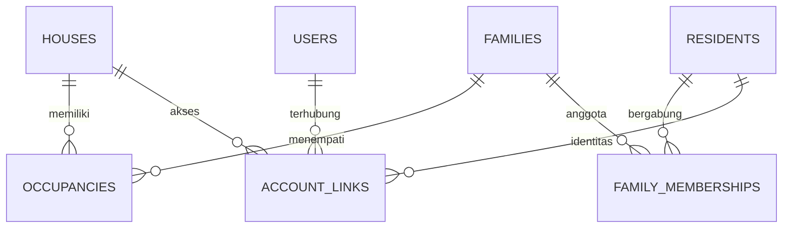
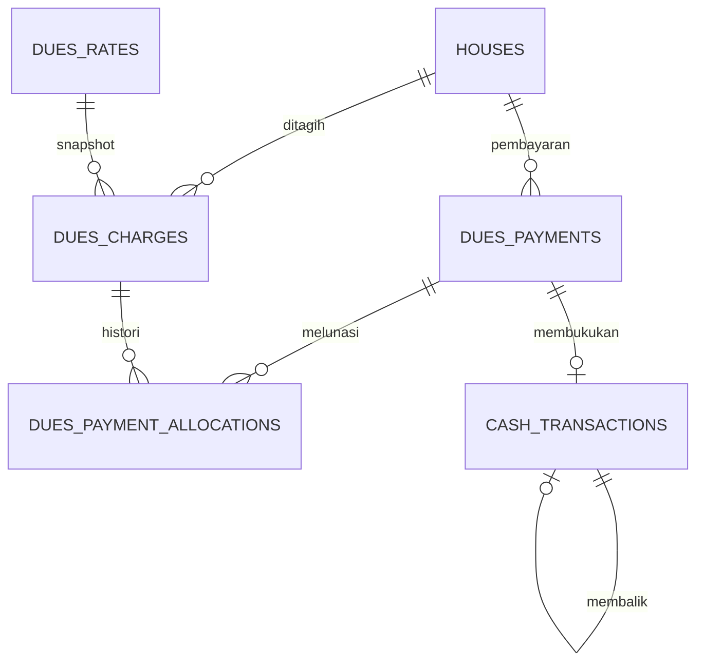

# ERD dan kamus data rancangan v1

Rancangan ini melengkapi kebutuhan dalam paket, bukan salinan ERD lama yang belum tersedia. Tabel infrastruktur Laravel boleh menggunakan bentuk framework resmi. Agent membuat migration bertahap per milestone, tidak membuat seluruh schema spekulatif pada M01.

## Rumah, keluarga, akun

Occupancy dan account link aktif mempunyai ended_at null. Primary aktif per rumah dibatasi constraint. Family membership menyimpan role keluarga dan rentang waktu. House tidak identik dengan akun.

| Tabel | Kolom penting dan relasi |
| --- | --- |
| users | id, name, email_normalized unique, password_hash, role resident/admin, status pending/active/inactive/archived, email_verified_at, notification_preferences json, archived_at |
| houses | id, code unique, block, street, number, address_key unique, ownership_note restricted, billing_enabled, billing_start_month, archived_at |
| families | id, head_resident_id FK residents nullable saat creation, verification_status, archived_at |
| residents | id, name, birth_year opsional, archived_at; tidak ada NIK wajib |
| family_memberships | id, family_id, resident_id, relationship, started_at, ended_at |
| occupancies | id, house_id, family_id, is_primary, occupancy_type owner/tenant, started_at, ended_at |
| account_links | id, user_id, resident_id, family_id, house_id, is_primary, started_at, ended_at |
| registration_invites | id, token_digest, token_ciphertext, activated_at, expires_at, revoked_at, rotated_by |
| additional_account_requests | id, user_id, target_house_id/target_family_id resolved privately, state, reviewed_by, reviewed_at, reason |
| password_reset_tokens | Framework Laravel; email, token hash, created_at |
| personal_access_tokens | Sanctum; token hash, owner, abilities, expires_at, last_used_at |

Circular family.head_resident_id dibuat lewat migration/order dan registration transaction yang aman; family pertama dibuat dengan head null lalu dikaitkan sebelum commit.

## Layanan dan konten

| Tabel | Kolom penting dan relasi |
| --- | --- |
| complaints | id, author_user_id, house_id snapshot, category, title, body, anonymous_to_residents, status, version, archived_at |
| complaint_status_events | id, complaint_id, from_status, to_status, note, actor_id, created_at |
| aspirations | id, author_user_id, house_id snapshot, title, body, anonymous_to_residents, status, version, archived_at |
| aspiration_status_events | id, aspiration_id, from_status, to_status, note, actor_id, created_at |
| agendas | id, title, description, starts_at, ends_at, location, status, created_by, archived_at |
| announcements | id, title, body, status, published_at, created_by, version, archived_at |
| notifications | id, event_id, recipient_id, type, safe_payload json, read_at, created_at; unique event/recipient |
| device_tokens | id, user_id, device_identifier, fcm_token encrypted, platform, active, last_seen_at |
| articles | id, slug unique, draft_payload json, published_payload json, status, version, published_at, created_by, archived_at |
| albums | id, slug unique, title, description, event_date nullable, cover_media_id, status, version, published_at |
| album_photos | id, album_id, media_asset_id, sort_order, alt, caption; unique album/media dan ordering tervalidasi |
| facilities | id, slug, title, description, location_description, condition_note, media_asset_id, status, version, archived_at |
| media_assets | id, owner_user_id, purpose, attachable_type, attachable_id, storage_key, mime, bytes, width, height, visibility, state, created_at |

Relasi media polymorphic diterapkan dengan allowlist morph map; tidak menerima nama kelas arbitrary dari client. Policy selalu memeriksa parent. Orphan/staging tidak public. Foto lampiran laporan menempel melalui media_assets; album_photos menyimpan urutan/metadata khusus album.

JSON article payload berstruktur title/category/summary/intro/sections/source/cover. published_payload adalah snapshot terpisah: edit draft tidak mengubah public revision sebelum publish. Untuk album published revision, simpan published_payload json yang memuat metadata serta ID media ready; album_photos dapat menjadi draft ordering. Tambahkan kolom snapshot tersebut saat M13.

## Keuangan

| Tabel | Kolom penting dan relasi |
| --- | --- |
| dues_rates | id, effective_month unique, amount_rupiah, created_by, reason |
| dues_charges | id, house_id, period, rate_id, amount_due, status unpaid/paid, created_at; unique house/period |
| dues_payments | id, house_id, amount_rupiah, paid_on, recorded_at, recorded_by, state posted/reversed, reversal_reason, replaces_payment_id |
| dues_payment_allocations | id, payment_id, charge_id, amount_rupiah, reversed_at; partial unique charge_id where reversed_at null |
| cash_transactions | id, type income/expense/reversal/opening_balance, category, signed_amount_rupiah, payment_id nullable unique, reversal_of nullable unique, description, posted_at, recorded_by |

Payment reversal: payment state reversed, allocations.reversed_at diisi, charge unpaid, cash reversal entry signed_amount = -original. Replacement merupakan payment baru, bukan mutasi nominal asal.

FK transaksi ke user/house tidak ON DELETE CASCADE. Arsip parent tidak menghapus audit/ledger. Cash original tetap ada. Penghitungan saldo menjumlah seluruh posting signed, termasuk reversal, sehingga tidak mengurangi original dua kali.

## Operasi

| Tabel | Kolom penting dan relasi |
| --- | --- |
| audit_logs | id, actor_id nullable untuk sistem, action, entity_type/id, safe_diff json, request_id, created_at |
| outbox_events | id UUID, type, aggregate_type/id, safe_payload json, available_at, dispatch_lease_until, attempts, published_at, completed_at, last_error_code |
| idempotency_requests | id, actor_id, route_scope, key, request_hash, state, response_status/body aman, created_at, completed_at |
| export_requests | id, requested_by, type, filter json, state, file_media_id, expires_at, error_code, created_at |
| system_settings | key unique, value json terstruktur, version, updated_by; tidak menyimpan credential |
| failed_jobs | Schema Laravel database-uuids; error harus disanitasi sebelum log/monitor |

Total rancangan awal 35 tabel termasuk tabel autentikasi dan failed_jobs. Jumlah ini tidak menjadi sasaran implementasi; tabel tambahan hanya jika requirement nyata. UUID/foreign key di tabel framework mengikuti adapter/model yang kompatibel dengan user UUID.

## State media dan ekspor

Media: uploaded → processing → ready atau failed → archived.
Ekspor: pending → processing → ready atau failed → expired.
Outbox: pending/leased → dispatched → completed; expired lease atau stale dispatched dapat direplay dengan consumer idempotent.

## Data yang tidak dikoleksi default

NIK, nomor KK, foto KTP, lokasi GPS presisi, biometrik, nomor rekening, kartu pembayaran. Schema tidak boleh menambahkan kolom tersebut hanya karena template CRUD memilikinya.

## Verifikasi migration

Tes constraints, row lock/concurrency, FK restricted delete, archive history, UUID framework auth, effective rate snapshot, dan month check pada Postgres nyata. Jangan memakai SQLite untuk membuktikan partial index atau concurrency Postgres.
